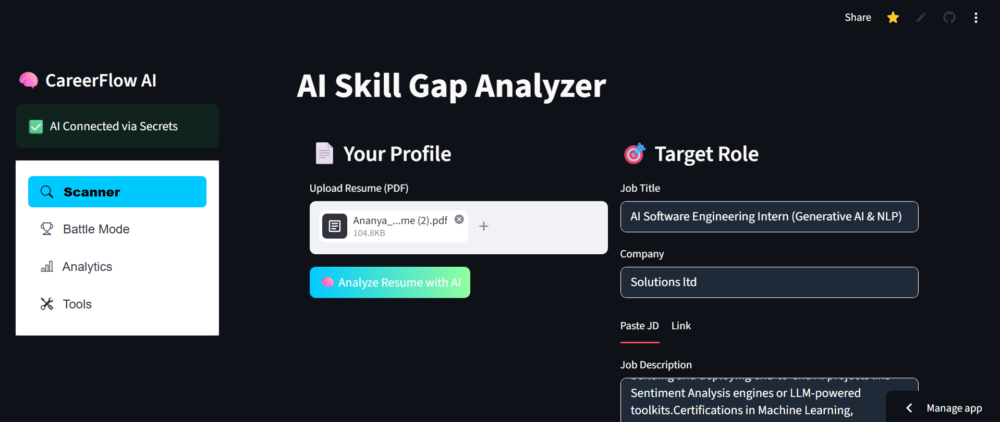
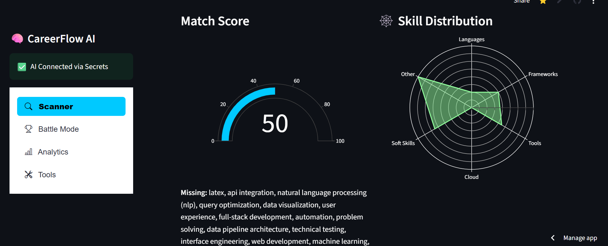
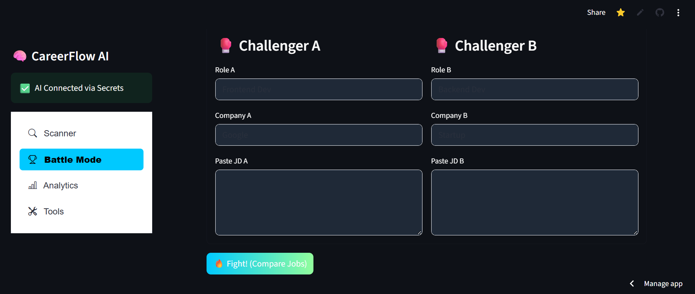
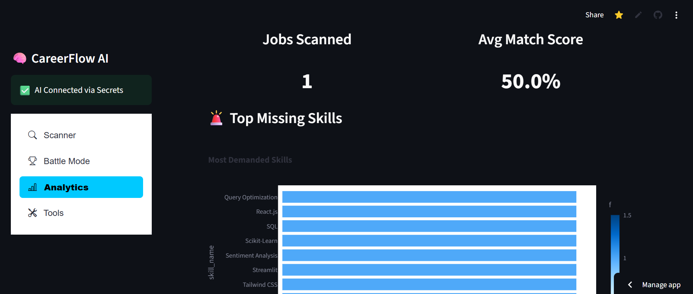
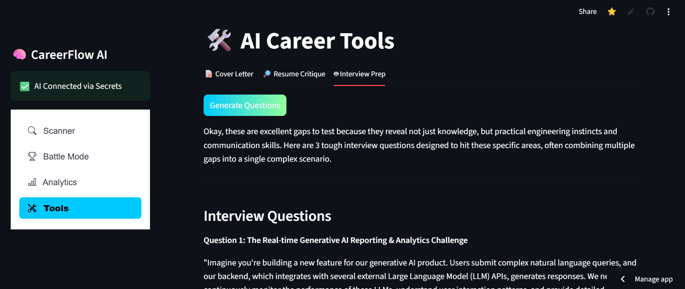

# 🧠 CareerFlow AI: Intelligent Career Toolkit

<p align="center">
  
  
  
  
  
</p>

**CareerFlow AI** is a professional-grade career optimization platform designed to bridge the gap between candidate profiles and industry requirements. By leveraging **Google Gemini 1.5 Flash**, it automates complex tasks like skill-gap analysis, resume scoring, and competitive offer comparison into a seamless, interactive experience on the web.

---
## 📸 Visual Tour

| **AI Skill-Gap Analyzer** | **Visual Match Analytics** |
| :--- | :--- |
|  |  |
| **Description:** Upload your resume to compare against specific job descriptions and identify technical gaps. | **Description:** Interactive Plotly radar charts visualizing skill distribution and a gauge meter for overall match scores. |

| **Job Battle Arena** | **Application Analytics** |
| :--- | :--- |
|  |  |
| **Description:** "Battle Mode" for side-by-side comparison of two different roles to optimize application strategy. | **Description:** Persistent tracking of scanned jobs, average match scores, and a bar chart of frequently missing skills. |

#### 🛠️ AI-Powered Career Toolkit
<p align="center">
  
  <br>
  <i><b>Description:</b> Leverages <b>Google Gemini 1.5 Flash</b> to generate tailored cover letters and tough, gap-specific interview questions.</i>
</p>

## ✨ Core Features

* **🔍 AI Skill-Gap Scanner**: Deep analysis of Resumes vs. JDs to extract missing technical and soft skills with actionable feedback.
* **⚔️ Job Battle Arena**: A data-driven side-by-side comparison tool that scores job offers based on long-term growth and relevance.
* **📊 Visual Analytics**: High-impact **Radar (Spyder) charts** and match donut charts for instant visual assessment of your professional profile.
* **📄 Automated PDF Generation**: Instantly creates tailored, professional cover letters ready for export based on your extracted skills.
* **🛡️ Secure Key Management**: Built with enterprise standards using Streamlit Secrets to protect sensitive API credentials.

---

## 🛠️ Technical Stack

* **Frontend & UI**: Streamlit with custom **Glassmorphism CSS** for a premium dark-mode aesthetic.
* **Intelligence Layer**: Google Generative AI (**Gemini 1.5 Flash**) for advanced NLP and reasoning.
* **Database**: **SQLite3** for persistent tracking and history of job application analytics.
* **Data Visualization**: **Plotly** for interactive charts and **Streamlit Lottie** for modern UI animations.
* **Document Processing**: PDFPlumber and FPDF for document parsing and generation.

---

## 🚀 Getting Started

### Prerequisites
* Python 3.12+
* Google Gemini API Key

### Installation
1.  **Clone the repository**:
    ```bash
    git clone [https://github.com/ananyajoshi-cseai/CareerFlow-AI.git](https://github.com/ananyajoshi-cseai/CareerFlow-AI.git)
    cd CareerFlow-AI
    ```
2.  **Install dependencies**:
    ```bash
    pip install -r requirements.txt
    ```
3.  **Environment Setup**:
    Add your personal API key to `.streamlit/secrets.toml` or directly into the Streamlit Community Cloud Secrets dashboard:
    ```toml
    GEMINI_API_KEY = "YOUR_API_KEY_HERE"
    ```

### Running Locally
```bash
streamlit run app.py
```
---

## 🤝 Contributing

Contributions are what make the open-source community such an amazing place to learn, inspire, and create. 

1. Fork the Project.
2. Create your Feature Branch (`git checkout -b feature/AmazingFeature`).
3. Commit your Changes (`git commit -m 'Add some AmazingFeature'`).
4. Push to the Branch (`git push origin feature/AmazingFeature`).
5. Open a Pull Request.

---

## 📜 License

Distributed under the MIT License. See `LICENCE` for more information.

## 👤 Author

**Ananya Joshi**
* B.Tech in Computer Science and Artificial Intelligence (CSE AI)
* Indira Gandhi Delhi Technical University for Women (IGDTUW)

---
